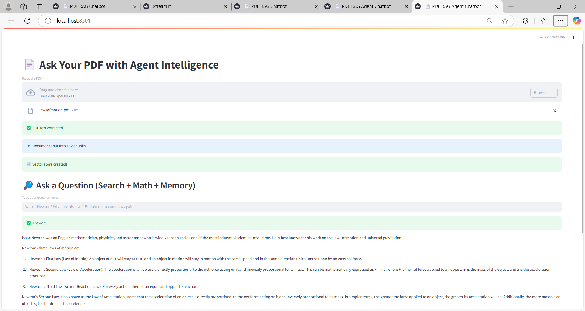

#  PDF RAG Chatbot with LangChain Agents

This project is an intelligent PDF assistant built using **LangChain**, **OpenAI**, **FAISS**, and **Streamlit**. It allows you to upload a NEET/NCERT-style PDF and ask questions — the agent will smartly answer using document retrieval, GPT, and even do math!

---

##  Features

-  Upload any NEET-style or textbook PDF
-  RAG: Uses FAISS + OpenAI Embeddings for semantic search
-  LangChain Agent handles:
  - Retrieval from PDF
  - Math calculations
  - Smart summarization
-  LangChain Memory: Multi-turn conversations with context
-  Math Tool: Ask `What is 12% of 150?` and get instant answers
-  Built with: `Streamlit`, `LangChain`, `OpenAI`, `FAISS`, `PyPDF2`

---

##  Demo

 <!-- optional -->

---

##  Installation

```
git clone https://github.com/your-username/pdf-rag-agent-chatbot.git
cd pdf-rag-agent-chatbot
python -m venv venv
source venv/bin/activate  # or venv\Scripts\activate on Windows
pip install -r requirements.txt


Create a .env file:

OPENAI_API_KEY=your_openai_key

 Run the App
 
 streamlit run app.py

Then open http://localhost:8501 in your browser.
```
## Tech Stack

Tool			Purpose
Streamlit	UI & Chat Interface
LangChain	RAG, Agent, Memory
OpenAI		GPT + Embeddings
FAISS		Fast vector DB
PyPDF2		PDF Parsing
dotenv		Secure API key storage


## Ideal For
NEET / JEE / CBSE PDF study assistants

Smart textbook Q&A apps

Chatbots using private documents

##  License
MIT License. Free for learning and portfolio use.